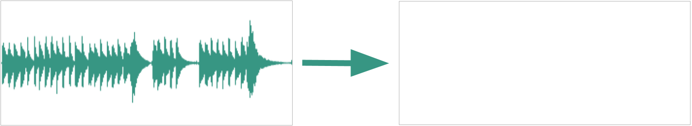

# Guitar TAB Generator

    This is the repository for my guitar TAB generation application. Upload an audio file of solo guitar playing, and then watch it be converted into playable TABs. 
     
    
     
    The website is live at <a href="https://tabgenerator.app/">tabgenerator.app</a>, running entirely in your browser. 
     NOTICE: currently this website uses a placeholder model because of an unforseen error. It may be a while before it works perfectly.

## About the repository

The core of this project involves two tasks: training a model, and building an app that uses it. 

The `Python` directory hosts the python files used to generate training data for the model, and then train a convolutional (and recurrent, actually) neural network on said data. It has various subfolders that host the individual files and functions for different subtasks in this goal. 

The `Website` directory hosts the React app that I built entirely from scratch so that an average computer user could take advantage of the model's usefulness. It runs entirely on client-side resources using Tensorflow_JS, with what I hope is an intuitive UI (I'm a backend dev, so it's intuitive for me, at least). Considering that my target audience is a group with relatively little technical expertise, this was important to me.

I've excluded the `Python/Data/` directory because that is where hundreds of artificially-generated files and the dataset were taking up almost a gigabyte of space. I figure that, because I provided the code I used to generate it, anyone interested in investigating my approach can simply generate the data themselves. Do note that this requires installation of fluidsynth, the application used to generate audio with soundfonts.

## What I'm doing now

Currently, I'm taking a break from my projects so I can focus on my recent placement at Bedrock Research and the upcoming honor orchestra season. Eventually, I'll start to tackle the TODO list for this project. Here's the very next steps for me:
- Find or Build a GPU-capable JS environment: After the errors I encountered when transferring a python-trained model into a TF.js model, I discovered that the only way to get it to work is to train the model natively in TF.js. Because this model is relatively complex, despite its small size, it will take a lot of compute power to train, especially on the massive dataset I've generated. If I were to try and do this on my CPU, I suspect it could take several days to a week, which is unreasonable given how much I use my devices. So, I'm going to try and get Tf.js-GPU running on my computer or find some sort of AWS-like system for me to train on.
- Train the final model: Once I've built the environment, it's as simple as generating a new, larger dataset to train on (increasing one variable in my code), then plugging that in to the fit function. I may try to redesign the model's structure from the ground up if I find that my current structure fails.
- Build more models: I want to build a model that isolates an instrument's audio from a full song, and a model that transcribes bass lines so I can improve my own. Building these models would be fairly simple given the synthetic data generation I'm already doing. I simply need to swap around some soundfonts here and there and then I'll have a bunch of new features added to this website.

## About the Project

  
Project Summary

  

  I've built an open-source web-app that can take in the audio of a song and generate playable guitar sheet-music based on what it hears. Specifically, it will generate Guitar TABs, which is a type of sheet-music that is especially made for beginner musicians (it simplifies complex notation into fret/string pairs). In a sense, I've built a tool that lets beginner guitarists play their favorite songs, even if they lack the skills to learn it by ear.
    
  The core of this project's functionality is a Convolutional Neural Network. This model parses a spectrogram of the audio, then it outputs any note-beginnings that it recognizes in those slices. Then, a separate function converts this into TABs by minimizing the distance between all fret choices to find the most playable version.
    
  This project is INCOMPLETE, I need to train the final JS model, but everything else is live.
  

  
Project Highlight

  

  My favorite thing about this project is watching other people use it. Once I got a locally-hosted tool up and running (using a Flask API and a very bare-bones GUI), I showed it off to some of my colleagues:
    
  The guitarist in my school's jazz band, Peter, comes from a rock background, and he's not very comfortable reading sheet music. Using my tool, he was able to learn the solo for our school's performance of "25 or 6 to 4" by Chicago.
    
  My elementary school music director, Mr. Shugert, runs private lessons with beginner guitarists, he's since used it with some of his young students.
    
  My brother, Andrew, is perhaps my most dear use case. I grew up listening to him peck through melodies in his room, learning every song by The Backseat Lovers by ear. Seeing him use it for the first time was perhaps the most fulfilling engineering experience I've had.
  

  
Contributions and Credit

  

  This was a lone-wolf project for me; nobody even knew I was working on it until I was almost done. I didn't even use tutorials. I was already very familiar with all the technologies I needed, so the only outside resource I used was simply the documentation of the Python and JS libraries.
    
  The closest thing to a mentor for me was Dr. Matthew Reisman (Co-founder of Bedrock Research). I told him about this project as an example of my previous ML experience, and he suggested that I make it into a tool that anyone, even non-programmers, could use.
    
  I'll go ahead and cite the main libraries used: 
  - TensorFlow, TensorFlow.js, Keras (machine learning) 
  - Music21 (MIDI creation, Shout out to Dr. Cuthbert) 
  - Mido (manipulating and analyzing MIDI file contents) 
  - NumPy (linear algebra; tensor handling) 
    
  Also credit to GitHub Pages for hosting the site, and ChatGPT for helping me debug.
  

  
Background Context

  

  At first, this project was essentially a victory lap after achieving the TensorFlow Developer Certificate from Google. I figured it'd be a great first project for me to apply what I've learned, while also expanding my knowledge along the way.
    
  Quickly, however, I realized that this is a tool that people would find useful. So, I decided to change it into a web-app that better fits the target audience. Specifically, I'm targeting this tool at musicians who aren't very computer-literate, so I've purposefully designed it to be as accessible and straight-forwards to use as possible.
    
  My biggest constraint is my outdated computers that struggle with ML tasks. Even just producing the dataset nearly bricked my laptop. And my desktop GPU just simply won't work with Tensorflow for some reason, no matter how many times I tell it off. This is why the final JS model isn't out yet.
  

  
Build Process

  

  The first step was building a synthetic database using MIDI and .WAV tools that generated audio-MIDI snippets to train a model on. Then I made a model that looked at one slice of a given audio file at a time, and output the notes it recognized. This worked well, but isn't ideal for TABS which want only the beginning of the notes.
    
  So, phase two was redesigning it all, including building a more diverse dataset and a more complex, recurrent model that saw many slices at once. This worked well too, and I got a near-perfect model.
    
  Eventually, once I realized this needed to be a website, I built a frontend and made it pretty, then I tried transferring my model from to TF.js... only for literally everything to break. I was encountering version errors that didn't exist in the documentation.
    
  So now, the final stage is me rebuilding EVERYTHING in JS, so this transfer isn't even required.
  

  
Reflection and Learnings

  

  This project was a bumpy road. Particularly, Tensorflow had significant compatibility issues with my hardware. So, I tried to run things in Colab where possible, but currently I'm faced with the lack of Colab-like tools to train the model in JS (that I know of). Despite me being professionally certified in the technology, I would prefer to never use TF or TF.js ever again.
    
  While the demo is currently up and running, it's not at all in its final state. On top of me needing to train the final model (which will take an unbelievable amount of time on my CPU, so yeah I'm procrastinating), I plan on improving the application so it can also isolate guitar audio from vocals, drums, or bass, and I'm also interested in creating a separate model to transcribe bass-lines to help me learn jazz bass.
    
  Overall, I'm proud of this project. It satisfies my interdisciplinary goals as an engineer.
  

