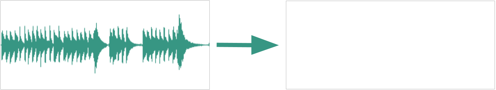
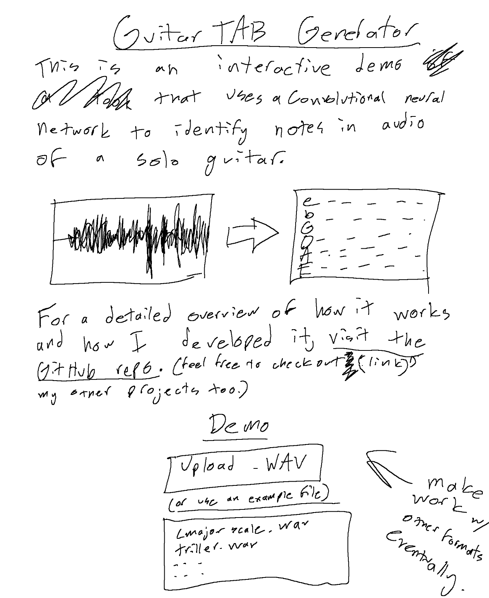
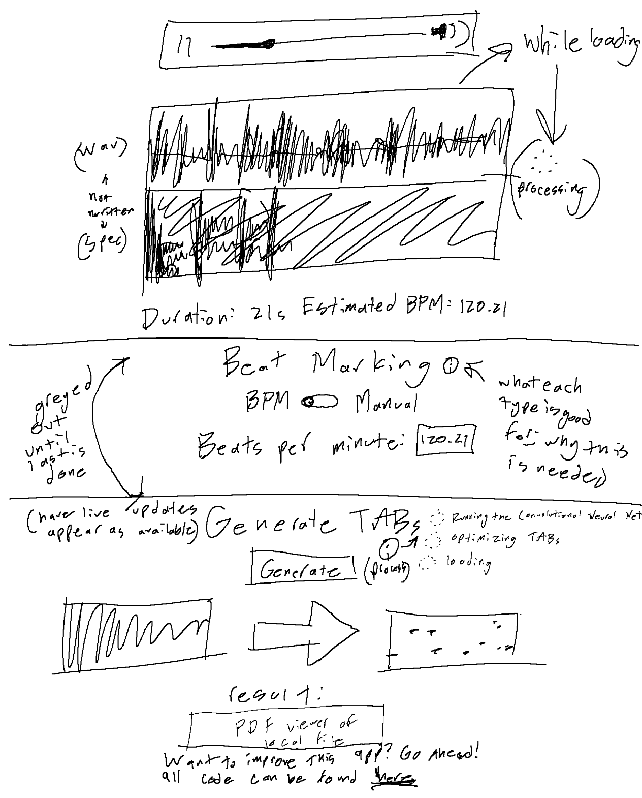

# Guitar TAB Generator

    This is the repository for my guitar TAB generation application. Upload an audio file of solo guitar playing, and then watch it be converted into playable TABs. 
     
    
     
    The website is live at <a href="https://tabgenerator.app/">tabgenerator.app</a>, running entirely in your browser. 
     NOTICE: currently this website is non-functional because of an unforseen error. I apologize, but it may be a week or two before this is funcitonal again.

## About the repository

The core of this project involves two tasks: training a model, and building an app that uses it. 

The `Python` directory hosts the python files used to generate training data for the model, and then train a convolutional (and recurrent, actually) neural network on said data. It has various subfolders that host the individual files and functions for different subtasks in this goal. 

The `Website` directory hosts the React app that I built entirely from scratch so that an average computer user could take advantage of the model's usefulness. It runs entirely on client-side resources using Tensorflow_JS, with what I hope is an intuitive UI (I'm a backend dev, so it's intuitive for me, at least). Considering that my target audience is a group with relatively little technical expertise, this was important to me.

I've excluded the `Python/Data/` directory because that is where hundreds of artificially-generated files and the dataset were taking up almost a gigabyte of space. I figure that, because I provided the code I used to generate it, anyone interested in investigating my approach can simply generate the data themselves. Do note that this requires installation of fluidsynth, the application used to generate audio with soundfonts.

## About the Project

  
Project summary

  

I've built an open-source web-app that can take in the audio of a song and generate playable guitar sheet-music based on what it hears. Specifically, it will generate Guitar TABs (tablature), which is a type of sheet-music that is especially targeted towards beginner musicians (it simplifies complex sheet music into fret/string pairs). In a sense, I've built a tool that lets beginner guitarists play their favorite songs, even if they lack the skills to learn it by ear.
  
The core of this project's functionality is a convolutional neural network. My application takes the audio and converts it into a spectrogram using FFTs, then the CNN looks at slices of that audio-image and output notes based on what it sees. Specifically, the model can see several 32nd-note slices at a time, and it outputs any note-beginnings that it recognizes in those slices.
I've then written a separate analytical function that takes the notes that the CNN recognizes and transforms them into playable Guitar TABs. It's a bit of an inefficient algorithm, but it essentially looks at every possible way to play the notes in any period of time, and finds which one minimizes distance and is (hopefully) easiest to play. 
  
I'm currently working on getting it running in an interactive web app, but that's still not its final state. I plan on improving the application so it can also isolate guitar audio from vocals, drums, or bass, and I'm also interested in creating a separate model to transcribe bass-lines to help me learn jazz bass.
  

  
Project highlight

  

My favorite thing about this project is seeing other people use it. Never before have I made something so helpful for other people. Once I got a local demo up and running, I showed it off to some of my colleagues, and the feedback was surprisingly very positive! People quickly started using it:
  
The guitarist in my school's jazz band, Peter, comes from a rock background, and he's not very comfortable reading sheet music. Using my tool, he was able to learn the music for our jazz band by transcribing recordings of the songs into a format he was familiar with, analyzing what the guitarist in the recording was doing and learning how to replicate it. 
My elementary school music director, Mr. Shugert, runs private lessons with beginner guitarists, and I told him about this project. He eagerly tried it out, and he's now encouraging its use among his students to help them learn their favorite songs.  
My brother, Andrew, is perhaps my most dear use case. I grew up listening to him slowly peck through songs in his room, learning every song by The Backseat Lovers by ear. I made this project with him in mind, and seeing him use it for the first time was perhaps the most personal fulfillment I've felt until now. It's so satisfying hearing how much he's been able to expand his musical breadth since I gave him this tool.
  
I think this project has taught me that I love helping people. I hope my projects in college and beyond are able to put smiles on peoples' faces like this one did.
  

  
Contributions and credit 

  

This was a lone-wolf project for me; nobody even knew I was working on it until I was almost done. I was already very familiar with all the technologies I needed, so the only outside resources I used was simply the documentation of the libraries I used.
  
The closest thing to a 'mentor' for me was Dr. Matthew Reisman (founder of Bedrock Research, see 'Jobs' section of my application). I told him about this project as an example of my previous ML experience, and he suggested that I make it into a tool that anyone, even non-programmers, could use. So, I took my python server and React frontend (which required lots of technical skill to set up) and combined them into one simple, user-friendly static-website that's hosted on GitHub-pages for all to use (which sounds a lot simpler to do than it actually was...).
  
I'll go ahead and cite the main python libraries used in this project:
 
TensorFlow, TensorFlow.js, Keras (machine learning)
 
Music21 (MIDI creation and bank/preset management)
 
Mido (manipulating and analyzing MIDI contents)
 
NumPy (linear algebra; tensor handling)
 
<a src="https://github.com/chrisguttandin/web-audio-beat-detector">Web Audio API</a> (estimated BPM detection)
 
<a src="https://www.reddit.com/r/FL_Studio/comments/ac05a7/guitarsuniversalsf2_real_guitar_samples_acoustic/">Guitar SoundFont</a> (for creating the synthetic data)
 
FluidSynth (converting generated MIDIs to .WAV using a .sf2 for synthetic dataset)
  

  
Background context

  

I started this project right after I finished studying for and achieving the TensorFlow Developer Certificate from Google. I figured it'd be a great first project for me to apply what I've learned, while also expanding my knowledge along the way. Aside from personal development, I also wanted to make something that would be useful for other people.
  
The constraints for this project were rather great. I don't have a GPU that can run Tensorflow code, and I can't quite afford the costs of computing services through AWS and google, so my machine learning abilities were limited, to say the least. Everything was made on a macbook air with minimal computing power.
  

  
Build process

  

This project was built in a sparse segments of free time over the past 4 or 5 months. I'd work on it in great depth for about 1-2 days at a time, a few times a month. As such, I wasn't able to follow traditional project planning and execution techniques; I'd arrive at the project once in a while and forget most everything that I was working on previously. 
  
Here's an overview of the many versions of this project:
<li>
The first version of this project was simply an .ipynb that would create a random-note dataset and then trained a very inefficient model to recognize notes in an audio file. 
</li>
<li>
The second version of this project was a very simple React Frontend and Flask Backend that I securely self-hosted for others to try out. This one worked really well, and was a very simple transition from my python environment to a hosted web app. Unfortunately, I don't want to publish that version because it'd open myself up to security risks.
</li>
<li>
The third version, and the one I'm currently finalizing, is run entirely on the client-side. This required designing the website for production, including optimizing images and algorithms, along with reducing the complexity of the model itself (which took tons of work, including improving the dataset). I made a plan of the design of the website (see below), and I feel I followed it pretty well.
 

</li>
Currently I'm in an admittedly frustrating situation. The model and website are working perfectly when independent, but for some reason the TensorflowJS library is not working with my models trained in python no matter how many things I try. And to make things worse, me trying to swap out Tensorflow installations appears to have corrupted my Fluidsynth installation, so now I can't make a .json dataset and retrain the model entirely within js, which was my original backup. My current plan is to reset my environment entirely and rebuild from the ground up to see where the issue is, but that's delaying the end result by several weeks because this is the busiest time of year for me.
  

  
Reflection and learnings

  

What started as a simple .ipynb quickly expanded into a full-stack web development process, cumulating in a final client-side product of more complexity than I originally planned. Most of the trouble along the way came from misorganizing my dependencies, especially relating to tensorflow and tensorflowjs. From my experience, Google's tensorflow framework has some of the worst backwards compatibility, or even plain compatibility with other libraries. Currently, this exact thing is the reason that the website doesn't work. For all of my future machine learning projects, I'll likely switch over to PyTorch for a smoother experience. I'll probably start using virtual environments for proper, professional dependency handline.
  
I'm still planning to expand on this project. here's a few of my ideas:
<li>Make a second model that isolates guitar audio from vocals, drums, and noise. This would allow full songs to be uploaded and the guitar could be extracted in one sweep. This would be straightforward to implement, I'd just need to adjust my dataset generation code to add in drums and other instruments in set patterns.</li>
<li>Make a separate tool that extends this music transcription feature to Jazz Bass lines. Again, this would be as simple as slightly adjusting the dataset generation so it makes walking bass lines.</li>
<li>I could even expand to more unique instruments, maybe making a Drum transcription tool or a vocal melody tool. Eventually, I could make a tool that recognizes all elements from a song, whether for royalty-free midi remakes or for experimenting with different soundfonts in the audio</li>
<li>Finally, and definitely the most complex application for my current skills, I could create an asynchronous process that could process a live audio recording into guitar tabs in real time. This would require significant optimization improvements, however, and I'd need to make some sort of custom beat-detection algorithm to find the measure breaks.</li>
 
Currently my schedule is packed to the brim, so it might be a long while before I get around to adding these features. However, you can see my work on other projects on my main github page.

